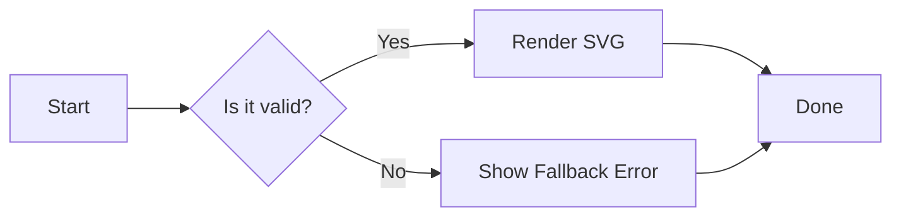
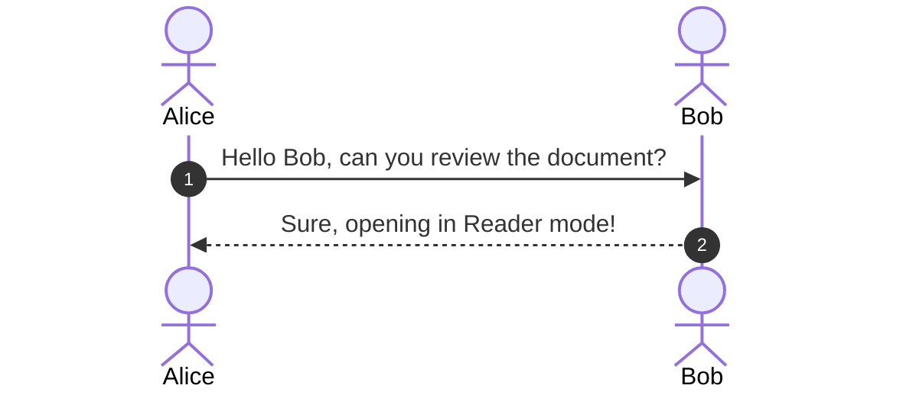
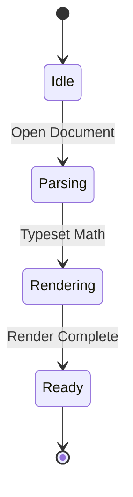

# Mermaid Diagram Specifications

## Flowchart

```mermaid
flowchart LR
    A[Start] --> B{Is it valid?}
    B -- Yes --> C[Render SVG]
    B -- No --> D[Show Fallback Error]
    C --> E[Done]
    D --> E
```

## Sequence Diagram

```mermaid
sequenceDiagram
    autonumber
    actor Alice
    actor Bob
    Alice->>Bob: Hello Bob, can you review the document?
    Bob-->>Alice: Sure, opening in Reader mode!
```

## State Diagram

```mermaid
stateDiagram-v2
    [*] --> Idle
    Idle --> Parsing : Open Document
    Parsing --> Rendering : Typeset Math
    Rendering --> Ready : Render Complete
    Ready --> [*]
```

